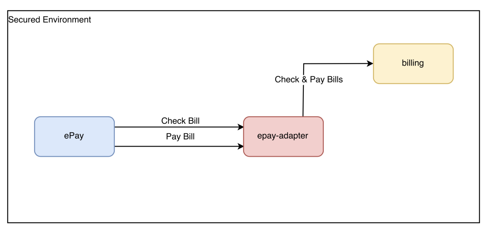

## go-epay
A generic ePay integration in Go

### Supported Modules
 * TelcoNG 
   An integration with the online payment processor of TelcoNG by using go-epay and telcong-epay-adapter. The first 
   one could be deployed on GAE whether the second one could be deployed on any environment. Note that the  billing-key-file
   should be issued from the administrative IAM panel of the platform.

### Architecture


### Building telcong-epay-adapter (Uses TCP)

```sh
go get github.com/clouway/go-epay

cd $GOPATH/src/github.com/clouway/go-epay/
make test
make install

telcong-epay-adapter --help
```

### Requirements
 * Go 1.8.x or greater

### License
Copyright 2018 clouWay ood.

Licensed under the Apache License, Version 2.0 (the "License");
you may not use this file except in compliance with the License.
You may obtain a copy of the License at

   https://www.apache.org/licenses/LICENSE-2.0

   Unless required by applicable law or agreed to in writing, software
   distributed under the License is distributed on an "AS IS" BASIS,
   WITHOUT WARRANTIES OR CONDITIONS OF ANY KIND, either express or implied.
   See the License for the specific language governing permissions and
   limitations under the License.

